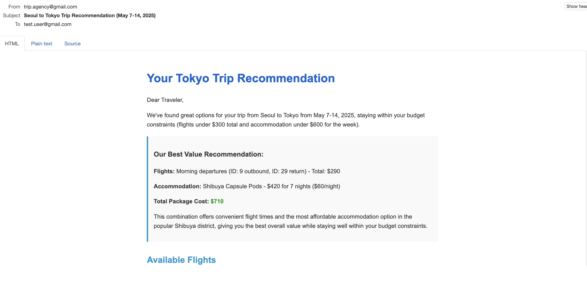
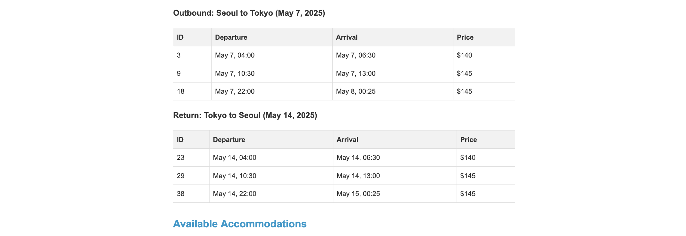
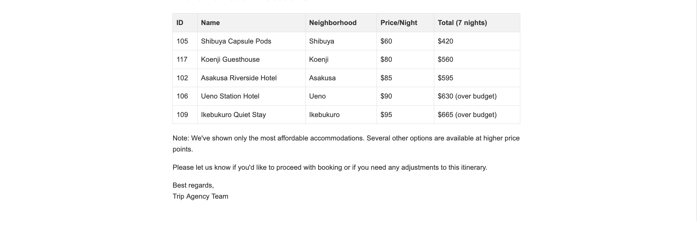

# trip-agent

This app represents an agency that searches for flights and accommodations via the
prompt from the user through a HTTP call. 

It's composed by a LLM (Anthropic) and tools to find flights, accommodations and sending mails. 

Once a search is requested the app will look for the flights, accommodations, 
and will email the requester with some options and the best value offer. 

## Prerequisites

## Running in local

Start a local email service. 
```shell
docker run -d -p 1025:1025 -p 8025:8025 mailhog/mailhog
```

Add your Anthropic Key
```shell
export ANTHROPIC_API_KEY=[your-key-here]
```

### Start the application

```shell
mvn compile exec:java
```

### Call the service 

```shell
curl http://localhost:9000/trip/search \
-H "Content-Type: application/json" \
-d '{"question": "find a bookingTripRequest from seoul to tokyo and back, from 2026-05-07 to 2026-05-14 The flight price not higher than 300 total and the total accommodation for the week not higher than 600. Send the suggestion to 'test.user@gmail.com'"
}'
```
This will return an `uuid` that you can later use the check the state of the workflow.

The email sent by the agent (you can find in `localhost:8025`) should be something like:






### Check the state

The workflow is the one in charge of leveraging the AI agent to look for the flights, accommodations, and send the email.
The workflow state when `RequestStatus[tag=SUCCESSFULLY_FINISHED, ...]` should also contain the list of flights and accommodation. 
You can check it with the following:
```shell
curl http://localhost:9000/trip/workflow/[uuid-here]
```

If all went well, flights have been created in the system and you should be able to access them like this:
```shell
curl http://localhost:9000/trip/flight/12
```

Same with the accommodations. 
```shell
curl http://localhost:9000/trip/accommodation/117
```

### Book a trip

Since you can find what flights and accommodations the workflow state holds (mentioned above) you can now book a trip:
```shell
curl http://localhost:9000/trip/book -d '{"flightRef":"12", "accommodationRef":"117"}' --header "Content-type: application/json"
```

You might want to check the state again to verify the flight and accommodation have been booked. 

```shell
curl http://localhost:9000/trip/flight/12
```

```shell
curl http://localhost:9000/trip/accommodation/117
```

## Running in Akka infra 
First you need to [deploy](https://doc.akka.io/operations/services/deploy-service.html) the service 
To send emails after deploying this app in the Akka infrastructure, you need to [set the env vars](https://github.com/akka-samples/ask-akka-agent/blob/main/src/main/resources/flat-doc/secrets.md):
```shell
SMTP_HOST
SMTP_PORT
SMTP_AUTH
SMTP_START_TLS
```

To use anthropic LLM, set the following env var.
```shell
ANTHROPIC_API_KEY
```

> **Note**: Sending emails has only been tested when running in local.

---------
Possible routes to extend the example: 
- improve prompt https://docs.spring.io/spring-ai/reference/api/prompt.html and include Patrik suggestions.
- Pre-reserve best value trip after request and send an email with that reservation to user 
- using timers to check if the flights/accommodations are still available in the market (fake must be then refactored to use a real/external endpoint)
- using views to check if flights already exist for the requested dates/constraints
